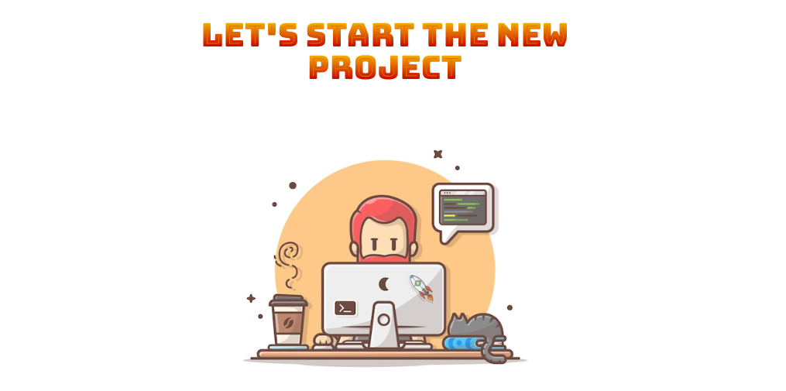

  

<h1 align="center">
  "Parcel" template
</h1>

  
  
  
  
    

## Description:

`Parcel` assembly for automating work processes  
in the projects development.

Thanks to help of the `gulp-gh-pages` module,  
you can publish content from the `dist` folder to `Gitub pages`

## Documentation

**Scripts:**
- `npm start` - start the project in development mode and local server
- `npm run build` - assemble the project in production mode
- `npm run watch` - The `watch` command is similar to `start`, but does not start a dev server (only a HMR server).
- `npm run clear` - remove directory `dist` and cache
- `npm run deploy` - deployment to gh-pages

**Use npm commands for install node modules:**
- `npm init -y` - initialization of the project
- `npm i parcel -D` - a module for building parcel assembly
- `npm i gh-pages -D` - Publish the `dist` directory to the gh-pages on GitHub

## Developers

- [Ihor Kuchin](https://github.com/ik-web)
